# Social Network:_Guide Ma+PA_

## Índice

* [1. Preámbulo](#1-preámbulo)
* [2. Definición del proyecto](#2-definición-del-proyecto)
* [3. Consideraciones generales](#3-consideraciones-generales)
* [4. Tecnologías Utilizadas](#4-tecnologías-utilizadas)
* [5. Flujo de trabajo](#5-flujo-de-trabajo)
* [6. Estructura de archivos](#6-estructura-de-archivos)
* [7. Pruebas unitarias](#7-pruebas-unitarias)
* [8. Interfaz desplegada](#8-interfaz-desplegada)
* [9. Desarrolladoras ](#9-desarrolladoras)

## 1. Preámbulo

El objetivo de este proyecto es adquirir conocimientos en el manejo de una _single page application (SPA)_, aprender a manejar herramientas como **Firebase** y ganar experiencia en el trabajo colaborativo a través de una situación y contexto ficticios. Nuestro objetivo es diseñar una interfaz interactiva que permita ingresar, validar datos e interactuar a través de una red social, nuestra tematica esta enfocada en el proceso diverso el cual es criar, y para ello hemos creado _Guide Ma+Pa_. 

## 2. Definición del proyecto
Para nuestro proyecto  **Guide Ma+Pa**, deberemos tener en cuenta las necesidades y expectativas de nuestros usuarios al momento de realizar el proceso de diseño de la interfaz,debemos comprender quiénes son nuestros usuarios y qué información desean ver y/o interactuar. Con base en esta comprensión, crearemos una interfaz amigable y fácil de usar que satisfaga las necesidades de nuestros usuarios.
## 3. Consideraciones generales
* Este proyecto se debe trabajar en equipos de tres.
* El rango de tiempo estimado para completar el proyecto es de 4 a 5 Sprints.
* La lógica del proyecto debe estar implementada completamente en JavaScript (ES6+), HTML y CSS 😃. (Sin hacer uso de librerias).

## 4. Tecnologías Utilizadas

**Github Project**: Es una herramienta de Github en la cual en lugar de aplicar una metodología específica a un proyecto proporciona características flexibles que puedes personalizar en función de las necesidades y los procesos del equipo, ya sea panel de tareas y/o hoja de ruta.

**Excalidraw**: Es una herramienta de pizarra colaborativa virtual que le permite esbozar fácilmente diagramas que parecen dibujados a mano.

**Firebase**: Es una plataforma para el desarrollo de aplicaciones web y aplicaciones móviles adquirida por Google. La cual utlizaremos apara la autenticación del usuario y el almacenamiento de la información de la app. 

**Vite**: Es una herramienta de compilación que tiene como objetivo proporcionar una experiencia de desarrollo más rápida y ágil para proyectos web, nos permite que el navegador automáticamente se actualice sin tener que refrescar y volver a cargar todo el sitio, al momento de realizar cambios.

**Figma**: Es una herramienta de diseño de interfaces de usuario, que permite crear, colaborar y prototipar diseños de manera eficiente y efectiva.

**HTML**: Es un lenguaje utilizado para estructurar y presentar contenido en la web, proporcionando elementos y etiquetas para crear y dar la estructura de una página.

**JavaScript**: Es un lenguaje de programación que se utiliza para agregar interactividad y funcionalidad a las páginas web, permitiendo crear efectos dinámicos, manipular datos y responder a las acciones del usuario.

**CSS**: Es un lenguaje de estilo utilizado para definir la presentación y apariencia visual de una página web, permitiendo controlar el diseño, el formato y los estilos de los elementos en el HTML. Y con su caracteristica _CSS Grid_ podemos adapatar el diseño.

**Git**: Es un sistema de control de versiones que facilita el seguimiento de los cambios en el código fuente, permitiendo gestionar y controlar las distintas versiones del proyecto, facilitando el trabajo colaborativo y la gestión de ramas y fusiones.

**GitHub**: Es una plataforma online basada en _Git_ que ofrece alojamiento de repositorios remotos y herramientas colaborativas, permitiendo compartir, colaborar y gestionar proyectos de forma más sencilla.

**Github Pages**: Permite a los usuarios de _GitHub_ crear y compartir sitios web públicos para proyectos, documentación, portafolios, etc.

**Jest**: Es un framework de pruebas unitarias de _JavaScript_, permite realizar afirmaciones y crear casos de prueba para verificar si el código se comporta como se espera.


## 5. Flujo de trabajo
Para establecer un flujo de trabajo eficiente, comenzamos organizando nuestro espacio en **Github Project**. Segmentamos todas las tareas requeridas en el proyecto, los objetivos de aprendizaje, las historias de usuario y los prototipos de baja y alta fidelidad. Progresivamente, profundizamos en cada uno de ellos, dividiéndolos en categorías como "Backlog", "Sprint Backlog" , "In progress", "In review" y "Ready". Este enfoque nos permitió tener una visión clara de las tareas pendientes y su progreso, lo que contribuyó a un desarrollo efectivo del proyecto.
## Definición del producto

Criar hijos es una de las experiencias más gratificantes y significantes de la vida de cualquier persona, sin embargo, es una tarea desafiante que requiere dedicación, paciencia y esfuerzo, lo cual es ¡agotador!. En Guide Ma+Pa, creemos firmemente que la crianza puede ser una aventura enriquecedora y positiva para padres y madres (mapadres) incluso para quienes aún no lo son. Nuestra plataforma ofrece un espacio seguro en donde puedes compartir recursos, consejos y apoyo para fomentar la colaboración en la crianza. Desde el anhelado embarazo hasta la desafiante adolescencia, queremos formar una comunidad confiable que brinde una experiencia gratificante y enriquecedora en este viaje maravilloso de criar.

¡Únase a Guide Ma+Pa y descubra la alegría de criar juntos!

## Historias de usuario
Con estas historias de usuario definiremos lo que el usuario desea de nuestro proyecto. 

**Criterio de aceptación general:**
- [x] Registro de usuario.
- [x] Login e Inicio de sesión.
- [x] Visualizar muro con publicaciones. 
- [x] Editar post.
- [x] Borrar post.

**Definicion de terminado General:**
- [x]  Registro fácil e intuitivo.
- [x] Cumple con los criterios de aceptación.
- [x] Debe ser una SPA.
- [x]  Es responsive.
- [x]  Pasan los test unitarios.
- [ ] Recibimos code review de al menos una compañera de otro equipo.
- [x] La documentación se encuentra actualizada en el readme.
- [x] Se realizan pruebas manuales buscando errores e imperfecciones simples.
- [ ] Se implementa todo el feedback que recibimos.
- [ ] Despliegue de aplicación y etiquetaron la versión (git tag).

### Historia de usuario 1
**YO** como mapadre **DESEO** crear una cuenta y unirme a la plataforma, **PARA** conectarme con otros papás y poder compartir experiencias y obtener consejos utiles para la crianza. Además, deseo tener la opción de registrarme utilizando mi cuenta de Google para evitar la necesidad de recordar una contraseña adicional.

**Criterios de Aceptación:**

- [x]  Cuenta con un boton claro donde poder realizar el registro desde la página de Inicio.
- [x]  Al hacer clic en el botón "crear cuenta" debe redirigir a una página de registro que pueda ingresar:
- nombre , apellido ,  nombre de usuario, correo, contraseña, confirmación de contraseña.
- [x]  botón de confirmar registro. (mensaje de confirmación que indique que mi cuenta ha sido creada exitosamente).
- [x]  Los errores en el formulario deben ser señalados de manera amigable en caso de que no se haya proporcionado la información necesaria o si hay un formato incorrecto en algún campo.
- [x]  Que la contraseña requiera contenidos mínimos de seguridad (6-10 caracteres, una mayúscula y un número, sin caracteres acentuados, no puede empezar ni terminar c on un espacio en blanco).
- [x]  verifique el correo sea valido y único, es decir, que no se repita en otro usuario.
- [x]  El usuario registrado también ha de ser único.
- [x]  En caso de que ya se encuentre registrado, lo derive a iniciar sesión.
- [x]  En caso de que el usuario exista dar opciones de sugerencia. 
- [x]  En caso de que la contraseña no coincida indicar que la corrija.
- [x]  Que la contraseña tenga un maskify, es decir, que no se visualice la contraseña correcta.
- [x]  Si elijo la opción "Registrarme con Google", al hacer clic en ese botón, debo ser redirigido a la página de inicio de sesión de Google, donde puedo autenticarme con mi cuenta de Google existente.

**Definición de terminado**

- [x] Cambiar los mensajes de alert a párrafos cuando exista un error en los input y definir un color para check 
- [x] Agregar un mensaje cuando den eviar y no hay datos en el formulario.
- [x] En el login agregar breve descripcion de la pagina y nombre abajo del logo.
- [x] Terminar el formato de css(botones, fuentes , etc.) para que se asemeje mas al prototipo de alta
- [x] Convertir a la funcion registerUser a una funcion asincrona para que se pueda llamar a la funcion navigateTo.
- [x] Configurar FirestoreDatabase para almacenar los datos del usuario cuando se registra (crear funciones correspondientes)
- [x] Agregar la funcionalidad de logout en el timeline (agregar icono, dar formato en css)


### Historia de usuario 2
**YO** como mapadre, **DESEO** entrar facilmente a la plataforma iniciando sesión tanto con mi correo y contraseña como con mi cuenta de Google, **PARA** ingresar rápidamente a acceder al contenido que deseo ver.

**Criterio de Aceptación:**

- [x] Ingresar con usuario/correo y contraseña.
- [x] Campos de inicio de sesión claros.
- [x] Junto al formulario de inicio de sesión con correo y contraseña, se debe proporcionar un botón adicional para "Iniciar sesión con Google". 
- [x] Ingresar a la página de Guide Ma+Pa. 

**Definición de terminado**

- [x] Al ingresar mi dirección de correo electrónico y contraseña válidos, se debe validar la información y permitirme acceder a mi cuenta, si la combinación de correo electrónico y contraseña no coincide con una cuenta existente, se debe mostrar un mensaje de error indicando que las credenciales son incorrectas; los mensajes de error son los siguientes 
- [x] En caso de que no exista el correo devolver mensaje /"Correo electrónico ingresado no existe ",
- [x] En caso de que la contraseña sea errónea: "la contraseña es incorrecta".
- [x] En caso que no escriba un correo "Ingresa un correo".
- [x] En caso de que el usuario no escriba contraseña, "Escribe la contraseña".
- [x] Que exista un botón de "entrar/iniciar sesión".
- [x] Al hacer clic en el botón "Iniciar sesión con Google", debo ser redirigido a la página de inicio de sesión de Google, donde puedo autenticarme con mi cuenta de Google existente.
- [x] Después de iniciar sesión con éxito, debo ser redirigido a la página de inicio.


### Historia de usuario 3

**YO** como usaria, **DESEO** ver el contenido que me interesa publicado en el feed de la plataforma **PARA** nutrirme de nuevos conocimientos respecto a maternidad.

**Criterio de Aceptación:**

- [x] Verificar si el usuario está logueado antes de mostrar contenido
- [x] Mensaje de Bienvenida 
- [x] Ver contenido en el muro 
- [x] Diseño organizado y fácil de leer, donde cada publicación debe incluir el nombre del autor, y  el contenido compartido.

**Definición de terminado**
- [x] En el header se muestra el logotipo de la aplicacion y el boton para cerrar sesion.
- [x] El boton de cerrar sesion te redirige al la pagina de inicio de la aplicacion.
- [x] Se muestra un saludo y el nombre del usuario logueado.
- [x] Hay un intup para escribir el mensaje y un boton para publicar.
- [x] Las publicaciones se muestran de forma clara.
- [x] la estructura de la vista está hecha dinamicamente con css grid.


### Historia de usuario 4

**YO** como mapadre **DESEO** poder publicar y editar el contenido que comparto sobre mis experiencias, consejos y recursos desmitificando las expectativas de la maternidad, **PARA** que otros mapadres puedan expresar (desahogarse) sus miedos y culpas o  angustias.

**Criterios de Aceptación**

- [x] Hay una opción para editar mi publicación después de haberla creado.
- [x] Se debe abrir un editor de texto o un formulario donde pueda modificar mi publicación.
- [x] Al modificar la publicación no debe permitir guardarla si no contiene texto.
- [x] Al modificar la publicación debe tener la opcion de cancelar o guardar cambios.
- [x]  Debe existir una caja de texto y un botón claramente visible que me permita acceder a la función de "Publicar"
- [x] Solo puedo publicar comentarios con información, nunca mensajes vacíos.

**Definición de terminado**
- [x] El nombre del usuario aparece en cada nueva publicacion.
- [x] Las publicaciones contienen máximo 300 caracteres.
- [x] Los botones de editar y eliminar solo aparecen en publicaciones del usuario logueado, no puede modificar publicaciones de otros usuarios.
- [x] El mensaje a editar se muestra en una ventana modal
- [x] En la modal aparecen dos botones para aceptar y guardar cambios.
- [x] Al dar click en el boton de aceptar, la modificación de la publicación se muestra en el muro.


### Historia de usuario 5

**YO** como mapadre **DESEO** tener la opción de eliminar publicaciones específicas de mi feed  **PARA** que pueda mantener mi experiencia personalizada y enfocada en el contenido que es relevante para mí.

**Criterios de Aceptación:**
- [x]  Debe existir un botón o icono claramente visible en cada publicación de mi feed que indique la opción para "Eliminar".
- [x] Al hacer clic en el botón de "Eliminar" en una publicación, debo recibir una confirmación para asegurarme de que realmente deseo eliminar esa publicación.
- [x]  Una vez que haya confirmado mi decisión de eliminar la publicación, esta debe desaparecer inmediatamente de mi feed.

**Definición de terminado**

- [x] El boton de eliminar solo aparecen en publicaciones del usuario logueado, no se puede eliminar publicaciones de otros usuarios.
- [x] El mensaje confirmar la eliminación de una publicación se muestra en una ventana modal
- [x] En la modal aparecen dos botones para borrar publicacion y cancelar.

## Diseño de la Interfaz de Usuario

En cuanto al diseño de la página, lo primero después de definir el tema a trabajar fue desarrollar un prototipo de baja fidelidad. Para ello realizamos prototipo de baja fidelidad en _Excalidraw_ que llevamos posteriormente a _Figma_.

### Prototipo de baja fidelidad en Excalidraw Movil
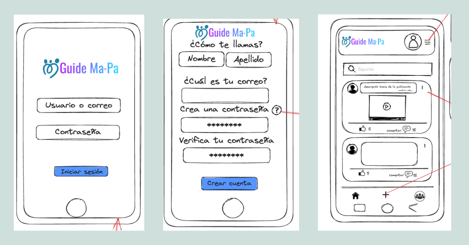

### Prototipo de alta fidelidad en Figma Movil
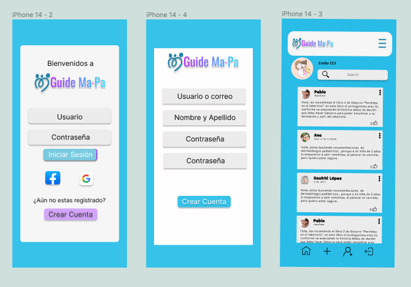

el cual se puede interactuar haciendo [_"Click aquí"_](https://www.figma.com/proto/R7hWxM4PaPMdiPLN40wfoI/Movil-Guide-Ma%2BPa?node-id=20-3127&starting-point-node-id=20%3A3127).
### Prototipo de baja fidelidad en Excalidraw Escritorio
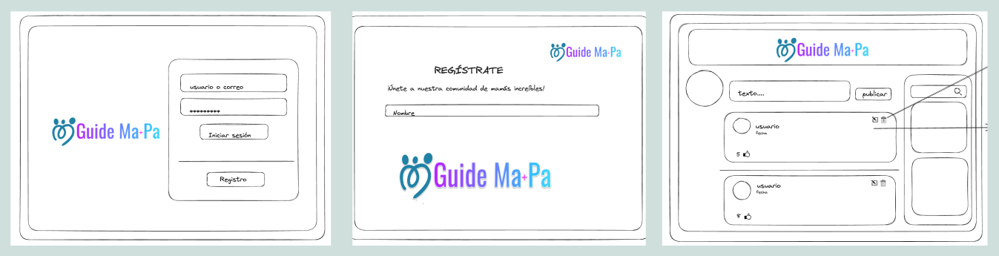

### Prototipo de alta fidelidad en Figma Escritorio
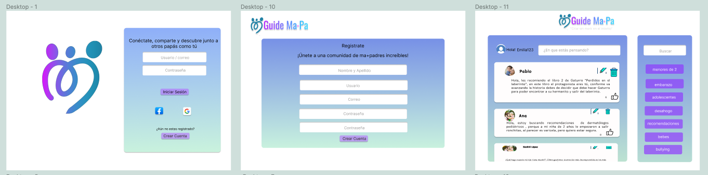


### Testeos de usabilidad a tráves de _Googleform_

Se solicito feedback a traves de un formulario y asi obtener opiniones y sugerencias para realizar mejoras iterativas de nuestro proyecto.

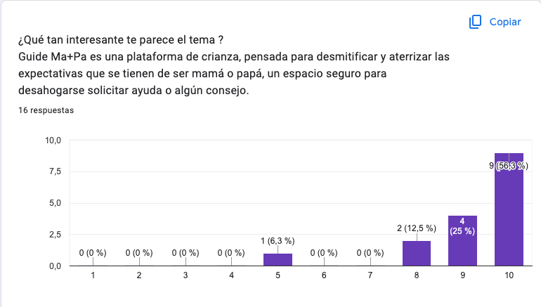

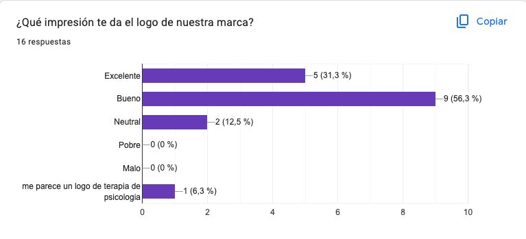


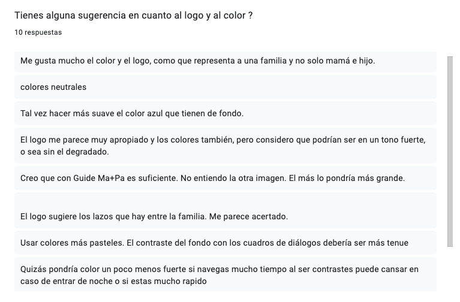
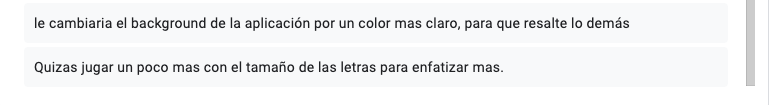

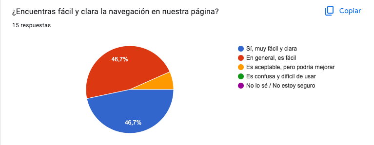

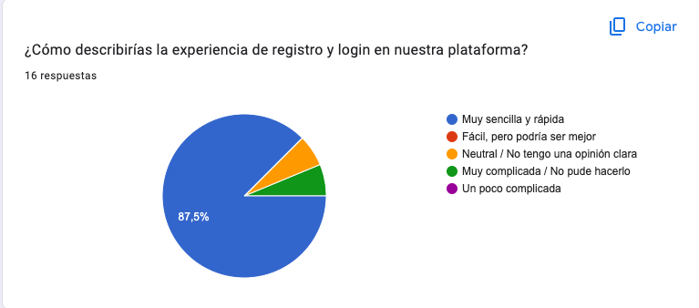

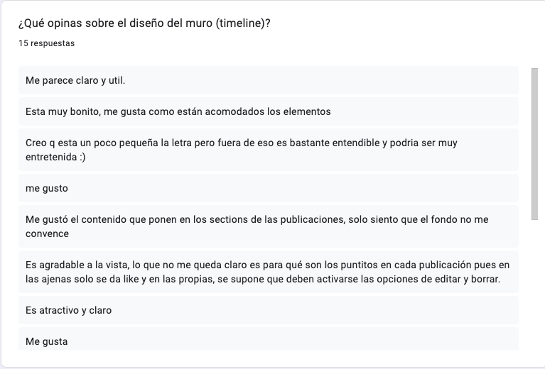
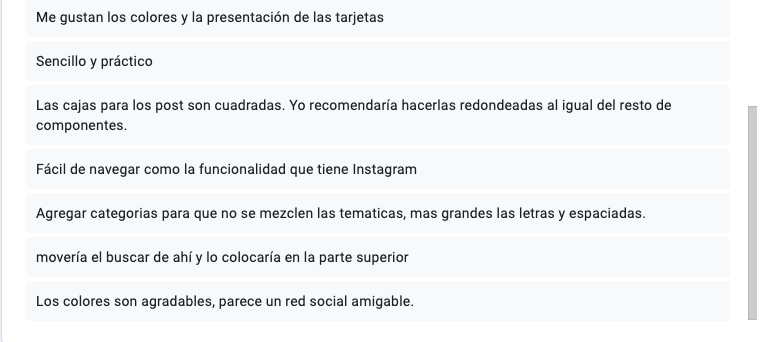

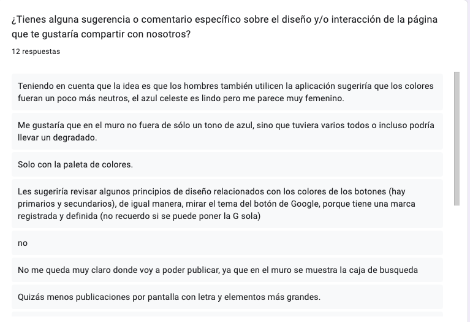
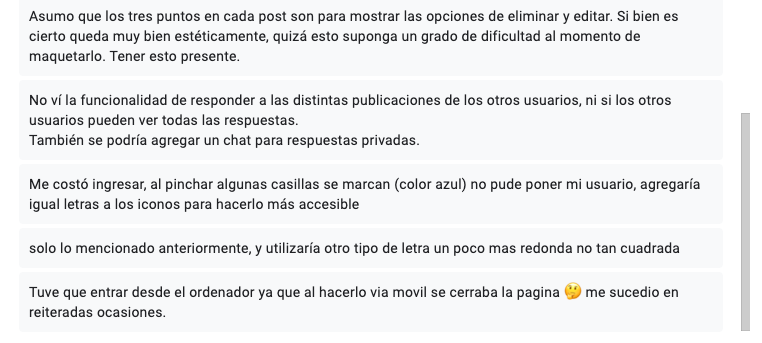


 Tras las diversidad de respuestas optamos por los siguientes cambios.


### Prototipo de alta fidelidad después del feedback Movil
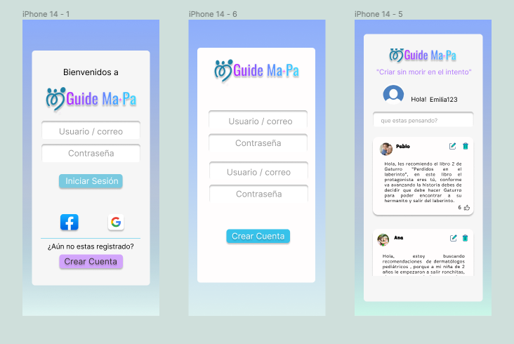

### Prototipo de alta fidelidad después del feedback Escritorio
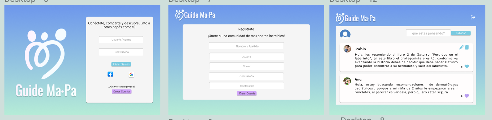

## 6. Estructura de archivos
```
.
├── README.md
├── package.json
├── explaindev.json
├── vite.config.js
├── src
|  ├── lib 
|  |  ├── credentials.js
|  |  ├── firebaseConfig.js
|  |  ├── initializerFirebase.js
|  |  ├── localStore.js
|  ├── components 
|  |  ├── registrer.js
|  |  ├── login.js
|  |  ├── timeline.js
|  |  ├── error.js
|  |  ├── newPost.js
|  ├── images
|  ├── imagReadme
|  ├── styles
|  |  ├── registrer.css
|  |  ├── login.css
|  |  ├── timeline.css
|  ├── index.html
|  ├── main.js
└── test
   └── index.spec.js
```
## Detalle de archivos 


**main.js**:En este archivo estan configuradas las rutas y el comportamiento de la navegación en la aplicación, así como manejo del estado de autenticación de Firebase. 

**index.html**:Contiene la estructura básica de la página web.

**README.md**:

**package.json**:

**explaindev.json**:

**vite.config.js**:

**src**:


**lib**:

**firebaseConfig.js**: Contiene _"firebaseConfig"_ el cual es un objeto de configuración de Firebase. Este objeto contiene los valores necesarios para conectar la aplicación web con los servicios de Firebase. 

**initializerFirebase.js**: Es donde  se inicializa Firebase y se exportan varias funciones y objetos relacionados con la autenticación y la base de datos. 

**credentials.js**:esta enfocado en la autenticación y manejo de usuarios de la aplicación.

**localStore.js**:


**components**: 

**registrer.js**: Este componente crea y configura la interfaz de usuario para la página de registro.

**login.js**: Este componente crea y configura la interfaz de usuario para la página de inicio de sesión.

**timeline.js**: Este componente crea y configura la interfaz de usuario para el muro de la aplicación.

**error.js**: Este componente crea y configura la interfaz de usuario para mostrar un mensaje de error cuando se accede a una página que no se encuentra (error 404).

**newPost.js**:Este componente crea y configura la interfaz de usuario para permitir a los usuarios escribir y publicar nuevas publicaciones en el muro de la aplicación


**images**: Contiene las imágenes utilizadas en la página.

**imagReadme**: Contiene todas las imágenes de este readme.


**styles**:Esta carpeta, contiene los estilos CSS del sitio web, aplicados para darle una apariencia visual atractiva a la página. 

**registrer.css**: Contiene el estilo de

**login.css**:

**timeline.css**:


**index.spec.js**:

## 7. Pruebas unitarias

## 8. Interfaz desplegada
Versión móvil
Esta es la interfaz final de la aplicación web en la vista de movil equivalente a 480 px.

Versión tableta
Esta es la interfaz final de la aplicación web en la vista de tableta equivalente a 720 px.

Versión escritorio
Esta es la interfaz final de la aplicación web en la vista de escritorio.

## 9. Desarrolladoras
- [Andrea Aparicio _(MX)_](https://github.com/AndyApG)
- [Patricia Chavez Romo _(MX)_](https://github.com/patychavezromo)
- [Paulina Torres A. _(CL)_](https://github.com/Paulytorres/)